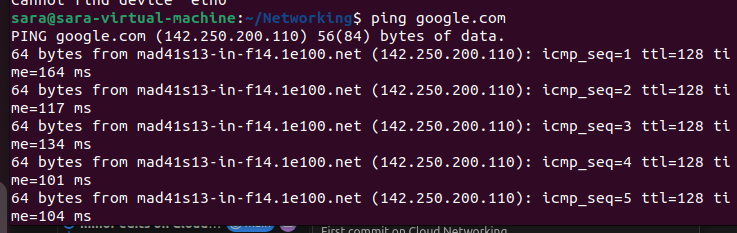

# 🌐 IP Addressing Deep Dive  
_ A Quick and Easy Guide_

Welcome to the world of **IP Addressing** where computers get their names on the internet. Without IPs, devices would just be yelling into the void.

## 🧠 What is an IP Address?

An **IP Address** (Internet Protocol Address) is a unique numerical label assigned to a device in a network so it can communicate with others. Think of it as your house address. Without it, Amazon would never deliver your goodies.

Two main versions exist:

| Version | Format | Total Addresses | Example |
|--------|--------|----------------|--------|
| IPv4 | 32 bit (4 octets) | About 4.3 billion | `192.168.1.10` |
| IPv6 | 128 bit | About 340 undecillion (massive!) | `2001:db8:85a3::8a2e:370:7334` |

## 📦 IPv4 Breakdown

IPv4 addresses are split into **4 octets** separated by dots:  
`A.B.C.D` = 8 bits each = 32 bits total

`A.B.C`- Network address or the Subnet ID
`D`- Device or Host address.

Example: 

`11000000.10101000.00000001.00001010`
`192.168.1.10`

### ✅ Private vs Public IPs

| Type | Description | Examples |
|------|------------|---------|
| Public | Used on the internet | `102.89.5.1` |
| Private | Used inside local networks | `192.168.0.0/16`, `10.0.0.0/8`, `172.16.0.0/12` |

---

### 🎭 NAT - The Secret Agent

**NAT** (Network Address Translation) lets private IPs talk to the internet by translating them to public ones. Like a receptionist who speaks to visitors on your behalf.

- Saves public IPs
- Adds security
- Essential in home and cloud networks

---

### 🔢 IP Classes (Old School but useful)

| Class | Range | Use Case |
|-------|-------|---------|
| A | 1.0.0.0 to 126.0.0.0 | Very large networks |
| B | 128.0.0.0 to 191.255.0.0 | Medium networks |
| C | 192.0.0.0 to 223.255.255.0 | Small networks |
| D | 224.0.0.0 to 239.0.0.0 | Multicast |
| E | 240.0.0.0 to 255.255.255.255 | Experimental |

---

## 🧠 What Is Subnetting?

### 🧮 Subnetting Starter Pack

Subnetting splits a big network into smaller networks.

Why?

- ✅ Better security (separate departments/servers)

- ✅ Reduce broadcast traffic (faster network)

- ✅ Efficient IP usage (no waste)

- ✅ Required in cloud (AWS VPC, Azure VNets, GCP VPC)

Think of a house:

- One big house = big network

- Rooms inside the house = subnets

- Each room gets its own keys = IP ranges

Example: 

`192.168.1.0/24` means  
- Network bits: 24  
- Host bits: 8  
- Hosts available: `2^8 - 2 = 254`

---

### 🧮 Key Basics You Need to know

| Concept            | Meaning                                                 |
| ------------------ | ------------------------------------------------------- |
| IP address         | Like a house address (e.g., 192.168.1.10)               |
| Subnet mask        | Shows how big/small the neighborhood is (255.255.255.0) |
| Network portion    | Street you live on                                      |
| Host portion       | House number                                            |
| CIDR (/24 /16 /20) | Shortcut to subnet mask                                 |

---

Helpful CIDR table:

| CIDR | Meaning | Hosts Available         |
| ---- | ------- | ----------------------- |
| /32  | 1 host  | 1 IP                    |
| /30  | 4 IPs   | 2 hosts                 |
| /29  | 8 IPs   | 6 hosts                 |
| /28  | 16 IPs  | 14 hosts                |
| /27  | 32 IPs  | 30 hosts                |
| /26  | 64 IPs  | 62 hosts                |
| /25  | 128 IPs | 126 hosts               |
| /24  | 256 IPs | 254 hosts ✅ very common |

Formula:

`Usable Hosts = 2^(32 - CIDR) - 2`

Example: /25 subnet
`2^(32-25) = 2^7 = 128`
`128 - 2 = 126 usable hosts`

---

### 👉 Common Subnet Masks

| Mask | CIDR |
|------|-----|
| 255.255.255.0 | /24 |
| 255.255.0.0 | /16 |
| 255.0.0.0 | /8 |

### 🍕 Easy Mental Model

Imagine you have 1 big pizza (/24)

> 192.168.1.0/24 has 254 hosts available.

You can slice it any way:

| Slice     | CIDR | Subnets | Hosts Each |
| --------- | ---- | ------- | ---------- |
| Half      | /25  | 2       | 126        |
| Quarter   | /26  | 4       | 62         |
| Eighth    | /27  | 8       | 30         |
| 16 slices | /28  | 16      | 14         |

### ✅ Subnetting Example: /24 into two /25

Original network:

`192.168.1.0/24`

Split into 2:

| Subnet   | Range                         | Usable Hosts | Broadcast |
| -------- | ----------------------------- | ------------ | --------- |
| Subnet 1 | 192.168.1.0 – 192.168.1.127   | .1-.126      | .127      |
| Subnet 2 | 192.168.1.128 – 192.168.1.255 | .129-.254    | .255      |

Memory trick:

- 256 / 2 = 128
- First block: .0
- Second block: .128

---

### ✨ Practical Examples

#### 🎯 Variable Length Subnet Mask (VLSM)

VLSM = give each subnet only what it needs, not fixed sizes.

Think AWS VPC:
Web tier may need 100 IPs
DB tier may need 20
Admins maybe 10

You don't waste space.

---

#### ✅ VLSM Example

We want networks for:

| Need   | Hosts |
| ------ | ----- |
| Dept 1 | 100   |
| Dept 2 | 30    |
| Dept 3 | 10    |

Start from largest need ⬇️

**Step 1: 100 hosts → needs /25 (126 hosts)**

`192.168.10.0/25`

**Step 2: 30 hosts → needs /27 (30 hosts)**

`192.168.10.128/27`

**Step 3: 10 hosts → needs /28 (14 hosts)**

`192.168.10.160/28`

Done ✅

### 🪄 Subnetting Quick Tricks

| CIDR Decrease | Network Doubles | Hosts Half     |
| ------------- | --------------- | -------------- |
| /24 → /25     | 2 networks      | 126 hosts each |
| /25 → /26     | 4 networks      | 62 hosts each  |
| /26 → /27     | 8 networks      | 30 hosts each  |

---

### 🔥 DevOps-Level Understanding

You will need subnetting for:

| Area               | Why                             |
| ------------------ | ------------------------------- |
| AWS VPC & Subnets  | Private vs Public tiers         |
| Kubernetes         | Pod & Service networks          |
| VPN                | No overlapping networks allowed |
| Docker             | Bridge networks                 |
| Corporate networks | VLAN planning                   |

#### In linux terminal: Display IP

`ip addr show`

##### `ip addr show` Output

| Section | Meaning |
|--------|--------|
`lo` | Local loopback network used inside your computer only |
`inet 127.0.0.1` | Localhost IPv4 address |
Interface name (`ens33`) | The actual network card your machine uses |
`inet 192.168.x.x/24` | Private IP used inside your LAN (not internet accessible) |
`inet6 fe80::` | Local IPv6 address |
`link/ether` | The device MAC address (unique hardware identifier) |

> 🚨 Pro Tip: When sharing screenshots, hide MAC address and private IP for security hygiene.

---

#### Assign IP

`sudo ip addr add 192.168.10.5/24 dev eth0`

---

#### Ping a host

`ping google.com`

| Output Part                          | Meaning                                                       |
| ------------------------------------ | ------------------------------------------------------------- |
| `PING google.com (142.xxx.xxx.xxx)`  | DNS resolved `google.com` to an IP address                    |
| `64 bytes from ...`                  | Response received — network is working                        |
| `icmp_seq=1`                         | Packet sequence number (which reply it is)                    |
| `ttl=XX`                             | Time-to-live; how many network hops remain before packet dies |
| `time=XX ms`                         | Round-trip time (latency) — lower is better                   |
| `ping: ctrl+c to stop`               | Stops the continuous ping                                     |
| `--- google.com ping statistics ---` | Summary of test results                                       |
| `packets transmitted/received`       | Shows if any packets were lost                                |
| `packet loss 0%`                     | No loss = stable network                                      |
| `rtt min/avg/max/stddev`             | Speed & consistency of network responses                      |

###### 💡 Important Concepts

- Ping uses ICMP protocol

- Checks connectivity + DNS + latency

- 0% packet loss + low ms = good network

**If ping fails, issue might be DNS, network cable/Wi-Fi, firewall, or gateway.**

---

#### Check public IP

`curl ifconfig.me`

---

### 📦 Bits vs Bytes — What's the Difference?

These two can really confuse a junior engineer, here is a short note on their differences.

| Term | Symbol | Size | Used For |
|------|--------|------|---------|
**Bit** | `b` | 1 binary digit (0 or 1) | Network speed, data transmission |
**Byte** | `B` | 8 bits | File size, memory, storage |

Think of it like this:

- **Bit = a single grain of rice**
- **Byte = a spoonful (8 grains)**

---

### ✅ Why It Matters

| Example | Means |
|--------|-------|
`100 Mbps` = 100 **Megabits per second** | Internet/network speed |
`100 MB` = 100 **Megabytes** | File size |

> ⚠️ **1 Byte = 8 Bits**  
So, if your internet is **100 Mbps**, your **max download speed ≈ 12.5 MBps**

📌 Calculation:  
`100 Mbps ÷ 8 = 12.5 MBps`

---

### 🧠 Quick Memory Trick

| Phrase | Helps you remember |
|-------|--------------------|
**b = bit = tiny** | lowercase letter, smaller unit  
**B = Byte = bigger** | uppercase letter, bigger unit  

---

### 💡 DevOps Note

In networking configs and speed tests:

- Bandwidth is measured in **bits**
- Storage/Memory is measured in **bytes**

You'll see terms like:

- `Kb`, `Mb`, `Gb` (kilobits, megabits, gigabits)
- `KB`, `MB`, `GB` (kilobytes, megabytes, gigabytes)

Different capitalization = **BIG difference**

---

You now understand why your ISP says **100 Mbps**, but your browser shows **12 MB/s** 

